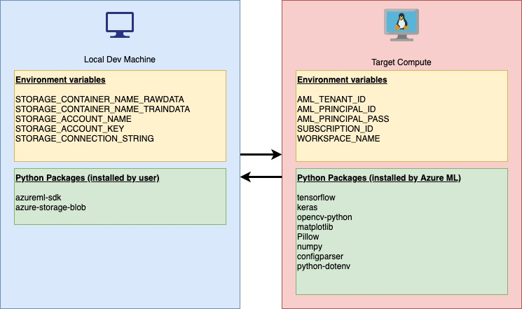
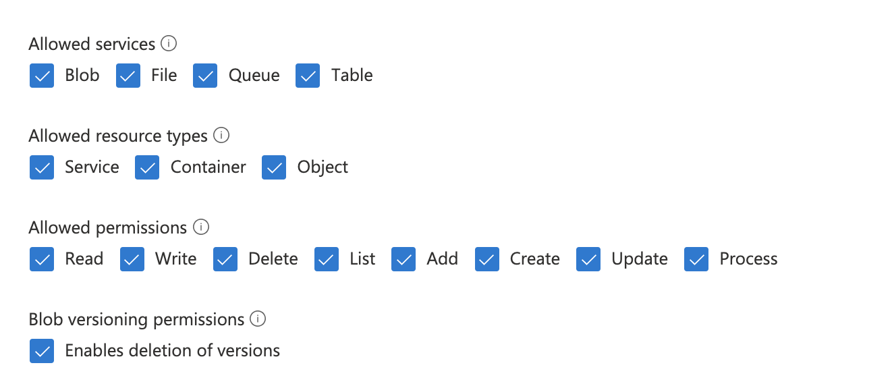
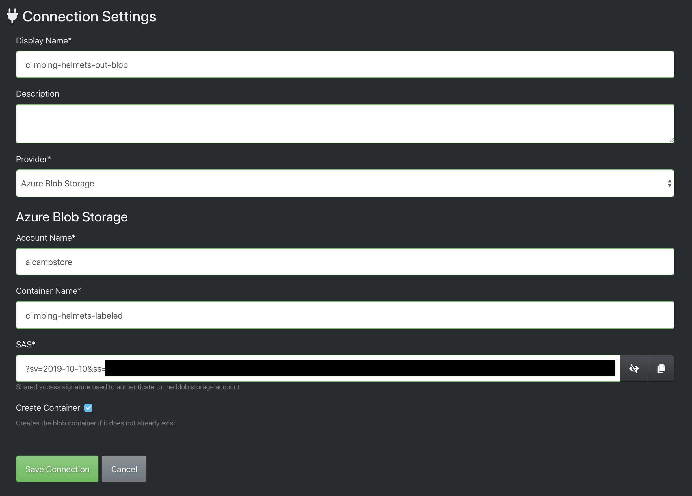
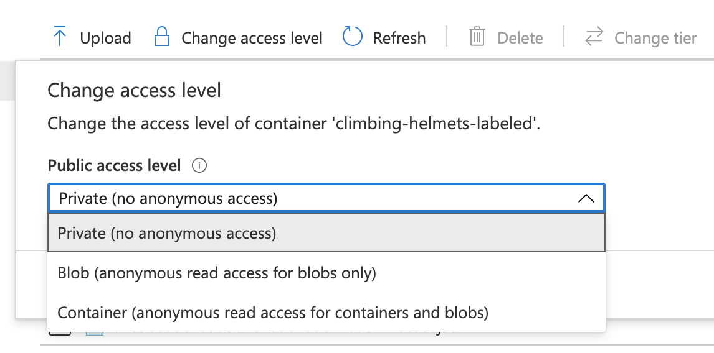
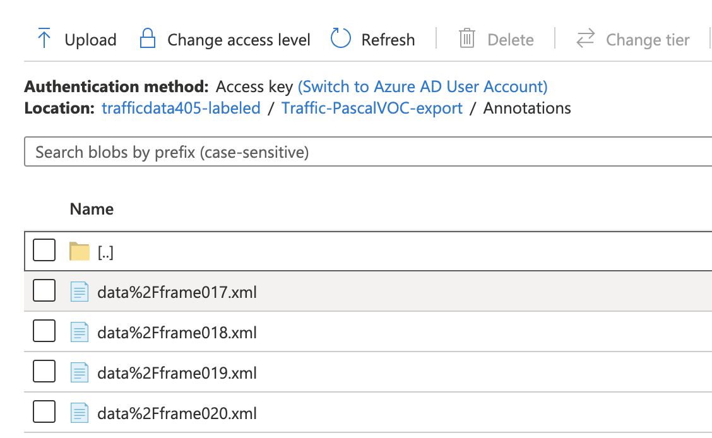

# A Keras Implementation of YOLO v3 for Custom Model Training with Azure Machine Learning

Keras is a deep learning framework that operates as a binding to lower level frameworks such as TensorFlow and CNTK.  Azure Machine Learning, an ML platform integrated with Microsft Azure for data prep, experimentation and model deployment, is exposed through a Python SDK (used here) and extension to the Azure CLI.  Together a custom Keras model for object detection is trained using the code and instruction in theis repo.  The ML practitioner must bring their own custom data to this process - hence any object detector can be trained by following the process below.

This work is based on:

* Keras YOLOv3 implementation for object detection https://github.com/qqwweee/keras-yolo3
* A fork for custom data https://github.com/michhar/keras-yolo3-custom (this repo is the Azure ML implementation).

YOLO stands for "you only look once" and is an efficient algorithm for object detection.  The following image is showing the results from a trained car detector.


Important papers on YOLO:

* Original - https://arxiv.org/abs/1506.02640
* 9000/v2 - https://arxiv.org/abs/1612.08242
* v3 - https://arxiv.org/abs/1804.02767
* v4 (new!) - https://arxiv.org/pdf/2004.10934.pdf

There are "tiny" versions of the architecture, often considered for embedded/constrained devices.

Website:  https://pjreddie.com/darknet/yolo/ (provides information on a framework called Darknet)

This implementation of YOLOv3 (Tensorflow backend) was inspired by [allanzelener/YAD2K](https://github.com/allanzelener/YAD2K).

---

## What You Do Here

1. Provision required resources in Azure
    - Azure ML Workspace
    - Azure Storage Account
    - Service Principal authentication for Workspace
2. Install prerequisite libraries
3. Register base model to Azure ML Workspace
4. Upload images or video to Storage
5. Label data with VoTT and export to Storage
6. Use driver Python script to train a model in the cloud
7. Download final model
8. Perform inference on video from camera


The driver script automatically calculates the optimal sizes for the anchor boxes and updates a config file for YOLOv3.  It also uses the config file to convert a pretrained Darknet model to Keras format for the custom number of classes.

## Prerequisites

1. <a href="https://azure.microsoft.com/en-us/account/" target="_blank">Azure Subscription (free trial link in upper, right corner)</a>
2. <a href="https://docs.anaconda.com/anaconda/install/" target="_blank">Python 3.6+ installed with pip</a>
3. <a href="https://github.com/microsoft/VoTT" target="_blank">Visual Object Tagging Tool</a>
4. <a href="https://docs.microsoft.com/en-us/cli/azure/install-azure-cli?view=azure-cli-latest" target="_blank">Azure CLI</a>
---

## System setup

The user's host machine (or VM if using one) for development (Windows, macOS, Linux) is refered to as the "local" or "dev" machine.  The machine or compute that trains the Azure ML models is refered to as the "target compute".  There is also the idea of the deployment machine.  For Azure ML this can be a local machine, Azure VM, Azure Container Instance, Azure Kubernetes Cluster, etc. (many more deployment target options).

In this repo, we have the local and the target machine setups.  The different setups are shown in the diagram below.  There are environment variables and Python packages that differ on each setup.  For example, Azure Storage related environment variables are set on the local or user dev machine.



## Provision required resources in Azure

1. Log in to Azure with the Azure CLI using your Azure credentials (this will be interactive/browser) - `az login`
2. <a href="https://docs.microsoft.com/en-us/azure/machine-learning/how-to-manage-workspace" target="_blank">Create an Azure ML Workspace</a>
  - Download the `config.json` from the Azure ML Workspace in the Azure Portal and place in the `project/.azureml` folder.  When using this file, interative authentication will need to happen (vs. through a Service Principal).

3. <a href="https://docs.microsoft.com/en-us/azure/storage/common/storage-account-create?tabs=azure-portal" target="_blank">Create an Azure Storage Account</a>

4. <a href="https://docs.microsoft.com/en-us/azure/machine-learning/how-to-setup-authentication#set-up-service-principal-authentication" target="_blank">Create a Service Principal</a>.
    - A Service Principal is the recommeded way for an unattended script or production system to authenticate with Azure ML for accessing a Workspace.
    - IMPORTANT: if you already have a Service Principal that you wish to use, you will still need to associate it with your Azure ML Workspace with the instructions in the link above.

## Install prerequisite libraries

Create a <a href="https://docs.python.org/3/library/venv.html" target="_blank">Python virtual environment</a>.

Use the Python package manager to install the Azure ML SDK.  Ensure using the intended `pip` (sometimes it's `pip3`).  It is **strongly recommended** to use a virtual environment for this project as very specific versions of packages are used and it makes debugging a local setup easier.

```unix
pip install azureml-sdk==1.5.0
```

You will also need the Python Azure Blob Storage package installed locally or wherever you run the raw data uploading Python script.

> Note the version number, here (you may have to uninstall `azure-storage-blob` if already installed).

```unix
pip install azure-storage-blob==12.3.1
```

## Register base model to Azure ML Workspace

Download either the full-sized YOLO v3 or the tiny version.

Download full-sized YOLOv3 here:  https://pjreddie.com/media/files/yolov3.weights

Or, on Linux:  `wget https://pjreddie.com/media/files/yolov3.weights`

> If the tiny version of the weights are needed, download this file, instead:  https://pjreddie.com/media/files/yolov3-tiny.weights

Run the following script to register the YOLO model to the Azure ML Workspace in the cloud (it uploads it in the background as well).  `--model-size` should be either `full` or `tiny`.

```unix
python register_local_model.py --model-size full
```


## Upload images or video to Storage

Define local environment variables as follows so that the upload script sends data to the right Azure Storage Account and container (this is going to be one single folder with all of the raw images to label - it will serve as input to the labeling process with VoTT in the next step).

**Windows**

Create a `setenvs.cmd` file with the following (do not include the `<>` characters).

```unix
set STORAGE_CONTAINER_NAME_RAWDATA=<Blob container name to store the raw image data before labeling>
set STORAGE_CONTAINER_NAME_TRAINDATA=<Blob container name for labeled data for training with Azure ML>
set STORAGE_ACCOUNT_NAME=<Storage account name>
set STORAGE_ACCOUNT_KEY=<Storage account key>
set STORAGE_CONNECTION_STRING="<Storage account connection string for the upload script>"
```

Run this `setenvs.cmd` on the command line in Windows and use the same terminal to run subsequent scripts.  Alternatively, each "set" command can be run on the command line separately - just make sure to use the same terminal window later on.

**Linux/MacOS**

Create a `.setenvs` file (or use any name) with the following (do not include the `<>` characters).

```unix
export STORAGE_CONTAINER_NAME_RAWDATA=<Blob container name to store the raw image data before labeling>
export STORAGE_CONTAINER_NAME_TRAINDATA=<Blob container name for labeled data for training with Azure ML>
export STORAGE_ACCOUNT_NAME=<Storage account name>
export STORAGE_ACCOUNT_KEY=<Storage account key>
export STORAGE_CONNECTION_STRING="<Storage account connection string for the upload script>"
```

Set these environment variables in the terminal window with `source .setenvs` command.  Make sure to use the same terminal window later on for running subsequent scripts.

Check that the environment variables were set correctly in Unix environments with the following command.

`env | more`

Create a local folder of raw images to be labeled and place all images into this folder.  Upload that folder to Azure Blob Storage and a specific container with the following script.  This container will then be accessed by the labeling tool, VoTT, in the next step.

If the images are in the `data` folder, for example, the script would be run as follows in the same terminal window in which the Storage-related environment variables were set.

```unix
python upload_to_blob.py --dir data
```

> Note:  the default access level is "Private (no anonymous access)" and can be changed with the SDK, as well as, in the Azure Portal by navigating to the contaniner within the Storage account and selecting "Change access level".

## Label data with VoTT and export to Storage

VoTT is the labeling tool that will be used locally to label data that is stored in the cloud and will write the labels directly back to a cloud store using a SAS token for REST authentication.  The tool imports from and exports directly to Azure Blob Storage containers specified while using the tool with no need to download data for labeling.  The images to label should exist already in a private Blob Storage container (the data from the previous step above).

Use the VoTT (<a href="https://github.com/microsoft/VoTT/releases" target="_blank">link to download</a>) labeling tool to create and label bounding boxes and export.  The Readme on the project page has good instructions, but the following should help clarify a few points.

The Source Connection and Target Connection from and to Blob Storage containers will use a SAS token for authentication.  Create the "SAS" or shared access signature in the Azure Portal in the Storage Account under the "Shared access signature" blade and set the permissions for "Service", "Container" _and_ "Object".



Create it to expire whenever it makes sense for your scenario.

For VoTT connection use the "SAS token" from the Azure Portal (it should start with a `?`).



> **Caution**:  A word of caution in using VoTT v2.1.0 - if adding data to the input Storage container/connection to label some more images, make sure to keep the **same** output container/connection for the labels, otherwise the old labels may not transfer over.  Also, ensure not to delete any files in the output storage container as it may interfere with current labeling (labels may disappear).  **Important**:  there will be one `something-asset.json` file per image in the base of the Blob Storage container containing the saved labels for VoTT.  Do not delete any of these files, otherwise when opening the project again, the labels will be gone.

Once you are done labeling, go to the Export settings and select **Pascal VOC**.  Then use the export button at the top of the app to export to the VoTT Target Connection defined earlier.


Your output in the cloud will have one folder with three subfolders in the new Storage container (the connection name used with VoTT).  Check the Azure Portal that this is the case.  


The structure should look similiar to the following, but with your name for the project (there will be many other files present, `something-asset.json` files, in the output Storage container along with this folder).

```
/ProjectName-PascalVOC-export
  /Annotations
  /ImageSets
  /JPEGImages
```

The annotations and images in this Storage container will then be used in the training script (mounted by Azure ML as a Data Store).

> **Important**:  It is good to check the "access level" in the Azure Portal of the exported images and labels, the Blob Storage container used in the connection - ensure it has "Private" access level if you do not wish the data to be Public.  To change, navigate to the container and select "Change access level".



Finally, to get back to the "Cloud Project" in VoTT, simply open VoTT 2, select "Open Cloud Project" and select the "target" connection or output connection and the `.vott` file (this is stored in Blob Storage container).

## Use driver Python script to train a model in the cloud

In order to use non-interactive authentication on the compute target, create `myenvs.txt` with the Service Principal information and place it in the `project` folder.  Remember, the `project` folder and its content are uploaded to the Azure ML compute target of your choosing and this is where these variables are utilized.  Create this file (it must be called `myenvs.txt`) with the following filled in with your information (do not include the `<>` characters).  This information should have been obtained from the Service Principal creation step in the [Provision required resources in Azure](#provision-required-resources-in-azure) section.

```unix
AML_TENANT_ID=<Tenant ID>
AML_PRINCIPAL_ID=<Client ID>
AML_PRINCIPAL_PASS=<Client Password>
SUBSCRIPTION_ID=<Subscription ID>
WORKSPACE_NAME=<Azure ML Workspace Name>
```

Define the class names in a file called `custom_classes.txt` and place it in the `project` folder, each class on a separate line, as in the following 2 class file example.

```
object
no_object
```

The training script, `project/train_azureml.py` does the following.

1. Calculates achor box sizes
2. Creates the proper config file (proper filter, anchor and class numbers)
3. Converts the YOLO v3 Darknet weights to Keras weights
4. Trains the YOLO model
  - Tracking the loss with Azure ML workspace (can be monitored from the Portal)
5. Saves the models to the `outputs` folder (the folder that persists after training in the Workspace)

> Technical note on anchor boxes:  filters=(classes + 5)x3 in the 3 [convolutional] before each [yolo] (<a href="https://github.com/AlexeyAB/darknet#how-to-train-to-detect-your-custom-objects" target="_blank">source</a>).

The driver script, `azureml_driver.py`, wrapping the training process, does the following.

1. Creates or reinitializes the target compute
2. Registers the Data Store (using the labeled data container and credentials found in local machine's environment variables) to Azure ML Workspace
3. Defines the TensorFlow Estimator with some of the command line arguments to point to the training script
4. Submits a Run under the Experiment name given in the command line arguments that runs the training script
5. Registers the intermediate and final model to the Azure ML Workspace for later use (e.g. in deployments)

Ensure the Azure Storage environment variables are still set in the current terminal.  See [Upload images or video to Storage](#upload-images-or-video-to-storage) section to set these again if needed.

To train the model with Azure ML run the driver, as in the following example (all arguments are required).

```unix
python azureml_driver.py --experiment-name carsv1 --gpu-num 1 --class-path custom_classes.txt --data-dir Traffic-PascalVOC-export --num-clusters 9 --ds-name trafficstore --bs 4 --lr 0.001
```

For help on using this script (as with the other scripts), run with `-h`.

```unix
python azureml_driver.py -h
```

## Download final model

Navigate to the Azure ML Workspace in the Azure Portal and go to the Experiment -> Run -> Outputs tab and download:

- Model (`trained_weights_final.h5`)
- `custom_anchors.txt`

Place these two files in the `project` folder so our inference script in the next step can find them.

## Perform local inference on images or video

To understand how to perform inference with the script, change directory into the `project` folder and run:  `python yolo_video.py -h` to see the help and argument options.  You can perform inference on single images, live video feed or a recorded video.  Output can be a labeled image, labeled streaming video or a labeled video output file.

### Inference on an image

Change directory into `project`.

In addition to other arguments, use `--image`

Example:  `python yolo_video.py --model-path trained_weights_final.h5 --anchors-path custom_anchors.txt --classes-path custom_classes.txt --conf 0.5 --image`

### Inference on video from a webcam

Note:  on linux `video0` is usually the built-in camera (if this exists) and a USB camera may be used so look for `video1` etc.  (if there is not camera, then `video0` is usually USB cam).  On MacOS, use for `--input` 0, for built-in, and 1 for USB.  This should be the same on Windows.

In addition to other arguments, use `--input <video device id>`

Example:  `python yolo_video.py --model-path trained_weights_final.h5 --anchors-path custom_anchors.txt --classes-path custom_classes.txt --conf 0.5 --input 0`

### Inference on video file and output to a video file

In addition to other arguments, use `--input <video file name> --output xyz.mov`

Example:  `python yolo_video.py --model-path trained_weights_final.h5 --anchors-path custom_anchors.txt --classes-path custom_classes.txt --conf 0.5 --input <path to video>/some_street_traffic.mov --output some_street_traffic_with_bboxes.mov`

## Deploying the solution to the cloud and edge

Instructions on using deployment files in this repo are coming soon.

## Credits

* Based on https://github.com/qqwweee/keras-yolo3

## References

* [Azure Machine Learning documentation](https://docs.microsoft.com/en-us/azure/machine-learning/)
* [Building Powerful Image Classfication Models Using very Little Data](https://blog.keras.io/building-powerful-image-classification-models-using-very-little-data.html) 
---

## Troubleshooting

1. Blob Storage upload issue:

```
  File "upload_to_blob.py", line 9, in <module>
    from azure.storage.blob import BlobServiceClient
ImportError: cannot import name 'BlobServiceClient'
```

Solve this by uninstalling and re-installing the Blob Storage Python package to a more recent version (you may be on a <a href="https://docs.microsoft.com/en-us/azure/storage/blobs/storage-quickstart-blobs-python-legacy" target="_blank">legacy version</a>).

```
pip uninstall azure-storage-blob
pip install azure-storage-blob==12.3.1
```

2. Driver script issue:  `utils.py", line 81, in kmeans    assert False` - this could mean:

    - There's an issue with your Datastore.  Check the Datastore in the Portal under your Azure ML Workspace to make sure it's pointing to the correct Blob Storage account and container.  Then, check the Blob Storage container to ensure it has the `--data-dir` that you specified when running the driver script (e.g. `Traffic-PascalVOC-export`) at the base level of the container.  You may need to define environment variables for driver script to locate these resources.  See, [Use driver Python script to train a model in the cloud](#use-driver-python-script-to-train-a-model-in-the-cloud) and "important" note.
    - There are images in the Datastore that are not tagged.  Go back to the VoTT tool, label the untagged images or set the project to export only tagged images (under Export Settings) and run the export again.
    - The folder structure for the labeled data in Azure Storage is not correct.  The folder structure should be as follows (note VoTT adds a prefix sometimes to the xml and jpg files like "data%2F").
    ```
    \your_container_name
      \Your_VoTT_Projec_tName-PascalVOC-export
        \Annotations
          data_image01.xml
          data_image02.xml
          data_image03.xml
          ...
      \ImageSets
        \Main
          object1_train.txt
          object1_val.txt
          object2_train.txt
          object2_val.txt
          ...
      \JPEGImages
        data_image01.jpg
        data_image02.jpg
        data_image03.jpg
        ...
      pascal_label_map.pbtxt
    ```
    Here is a screenshot of the Annotations folder<br>:
    

3.  If there is a `ResourceExhaustedError` with a message such as follows in the `70_driver_log.txt`, then this means the GPU on the compute target ran out of GPU memory for the CUDA code/tensors.

```
"error": {
    "code": "UserError",
    "message": "User program failed with ResourceExhaustedError: OOM when allocating tensor with shape[8,38,38,512] and type float on /job:localhost/replica:0/task:0/device:GPU:0 by allocator GPU_0_bfc\n\t [[{{node conv2d_66/convolution}}]]\nHint: If you want to see a list of allocated tensors when OOM happens, add report_tensor_allocations_upon_oom to RunOptions for current allocation info.\n\n\t [[{{node loss/add_74}}]]\nHint: If you want to see a list of allocated tensors when OOM happens, add report_tensor_allocations_upon_oom to RunOptions for current allocation info.\n",
```

 Solve this by decreasing the batch size when running the driver script, `azureml_driver.py`.  This would be setting the batch size argument `--bs` to a smaller value (2 instead of 4 for instance).


## Extra notes

Recording video on Mac OS for testing example.  From the command line with `ffmpeg` program (need to install first):

`ffmpeg -f avfoundation -framerate 30 -i "0" -r 30  video.mpg`

Where `-r` is framerate and `-i` is the camera input (0 is builtin camera on Mac OS).

## Some issues to know

1. Default anchors can be used. If you use your own anchors, probably some changes are needed - the training script now calculates these automatically for you.

2. The inference result is not totally the same as Darknet but the difference is small.

3. The speed is slower than Darknet. Replacing PIL with OpenCV may help a little.

4. Always load pretrained weights and freeze layers in the first stage of training. Or try Darknet training. It's OK if there is a mismatch warning.

5. The training strategy is for reference only. Adjust it according to your dataset and your goal. And add further strategy if needed.