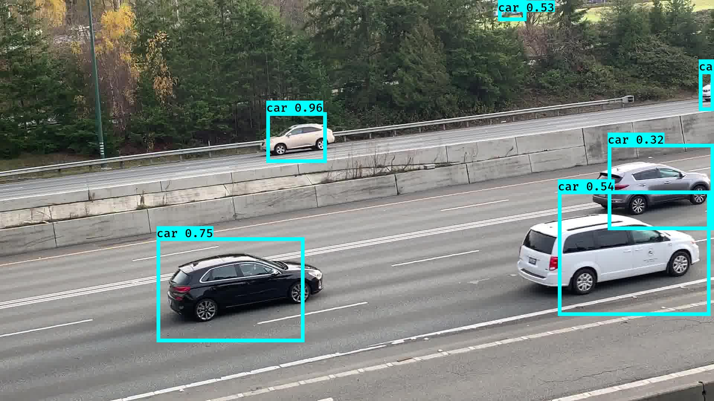
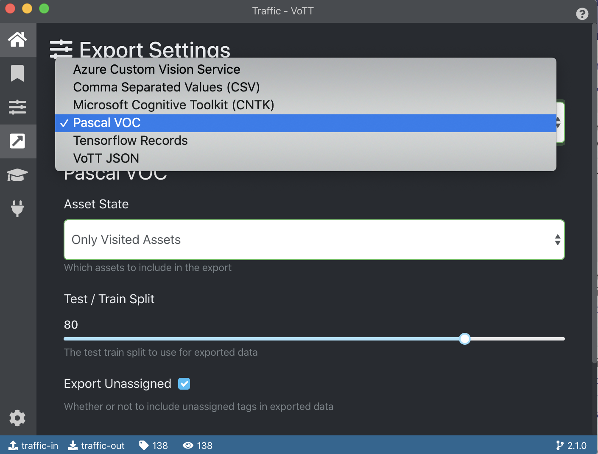
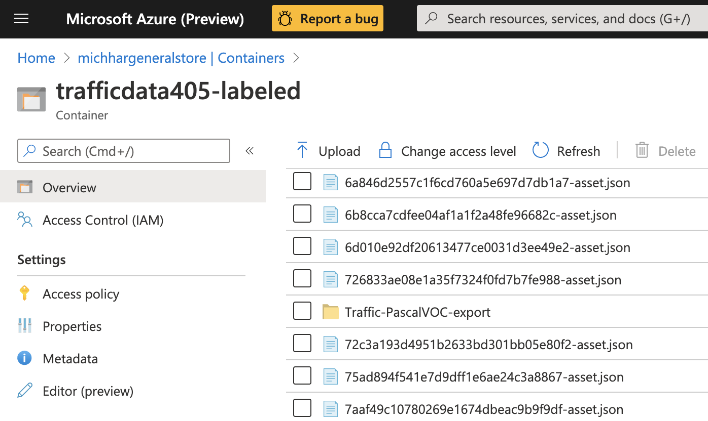

# A Keras Implementation of YOLO v3 for Custom Model Training with Azure Machine Learning

Keras is a deep learning framework that operates as a binding to lower level frameworks such as TensorFlow and CNTK.  Azure Machine Learning, an ML platform integrated with Microsft Azure for data prep, experimentation and model deployment, is exposed through a Python SDK (used here) and extension to the Azure CLI.  Together a custom Keras model for object detection is trained using the code and instruction in theis repo.  The ML practitioner must bring their own custom data to this process - hence any object detector can be trained by following the process below.

This work is based on:

* Keras YOLOv3 implementation for object detection https://github.com/qqwweee/keras-yolo3
* A fork for custom data https://github.com/michhar/keras-yolo3-custom (this repo is the Azure ML implementation).

YOLO stands for "you only look once" and is an efficient algorithm for object detection.  The following image is showing the results from a trained car detector.



Important papers on YOLO:

* Original - https://arxiv.org/abs/1506.02640
* 9000/v2 - https://arxiv.org/abs/1612.08242
* v3 - https://arxiv.org/abs/1804.02767

There are "tiny" versions of the architecture, often considered for embedded/constrained devices.

Website:  https://pjreddie.com/darknet/yolo/ (provides information on a framework called Darknet)

This implementation of YOLOv3 (Tensorflow backend) was inspired by [allanzelener/YAD2K](https://github.com/allanzelener/YAD2K).

---

## What You Do Here

1. Provision required resources in Azure
    - Azure ML Workspace
    - Azure Storage Account
    - Service Principal authentication for Workspace
2. Install prerequisite libraries
3. Register base model to Azure ML Workspace
4. Upload images or video to Storage
5. Label data with VoTT and export to Storage
6. Use driver Python script to train a model in the cloud
7. Download final model
8. Perform inference on video from camera


The driver script automatically calculates the optimal sizes for the anchor boxes and updates a config file for YOLOv3.  It also uses the config file to convert a pretrained Darknet model to Keras format for the custom number of classes.

---

## Provision required resources in Azure

1. <a href="https://docs.microsoft.com/en-us/azure/machine-learning/how-to-manage-workspace" target="_blank">Create an Azure ML Workspace</a>
  - Download the `config.json` from the Azure ML Workspace in the Azure Portal and place in the `project/.azureml` folder.  When using this file, interative authentication will need to happen (vs. through a Service Principal).

2. <a href="https://docs.microsoft.com/en-us/azure/storage/common/storage-account-create?tabs=azure-portal" target="_blank">Create an Azure Storage Account</a>

3. <a href="https://docs.microsoft.com/en-us/azure/machine-learning/how-to-setup-authentication#set-up-service-principal-authentication" target="_blank">Create a Service Principal</a>.
  - A Service Principal is the recommeded way for an unattended script or production system to authenticate with Azure ML for accessing a Workspace.

## Install prerequisite libraries

Use the Python package manager to install the Azure ML SDK.  Ensure using the intended `pip` (sometimes it's `pip3`).

```unix
pip install azureml-sdk==1.5.0
```

## Register base model to Azure ML Workspace

Download either the full-sized YOLO v3 or the tiny version.

Download full-sized YOLOv3 here:  https://pjreddie.com/media/files/yolov3.weights

Or, on Linux:  `wget https://pjreddie.com/media/files/yolov3.weights`

> If the tiny version of the weights are needed, download this file, instead:  https://pjreddie.com/media/files/yolov3-tiny.weights

Run the following script to register the YOLO model to the Azure ML Workspace in the cloud (it uploads it in the background as well).  `--model-size` should be either `full` or `tiny`.

```unix
python register_local_model.py --model-size full
```


## Upload images or video to Storage

Define some local environment variables as follows so that the script running on the compute target knows about the Azure Storage Account for the data.

**Windows**

Create a `setenvs.cmd` file with the following:

```unix
set STORAGE_CONTAINER_NAME_TRAINDATA=<Blob container name for trained data>
set STORAGE_ACCOUNT_NAME=<Storage account name>
set STORAGE_ACCOUNT_KEY=<Storage account key>
```

**Linux/MacOS**

Create a `setenvs.sh` file with the following:

```unix
export STORAGE_CONTAINER_NAME_TRAINDATA=<Blob container name for trained data>
export STORAGE_ACCOUNT_NAME=<Storage account name>
export STORAGE_ACCOUNT_KEY=<Storage account key>
```

Run the .cmd or shell script to set the environment variables in the current terminal window.


Create a folder of images to be labeled, locally, and place all images in this folder.  Upload that folder to Azure Blob Storage with the following script.

If the images are in the `data` folder, for example, the script would be run as follows.

```unix
python upload_to_blob.py --dir data
```

## Label data with VoTT and export to Storage

VoTT is the labeling tool that will be used locally to label data that is stored in the cloud and will write the labels directly back to a cloud store using a SAS string for REST authentication.  The tool imports from and exports directly to Azure Blob Storage containers specified while using the tool with no need to download data for labeling.  The images to label should exist already in a private Blob Storage container (the data from the previous step above).

Use the VoTT (<a href="https://github.com/microsoft/VoTT/releases">link to download</a>) labeling tool to create and label bounding boxes and export to **Pascal VOC**.  The Readme on the project page has excellent instructions on connecting to Blob Storage.

Exporting as **Pascal VOC**:



Your output in the cloud will have one folder with three subfolders in the new Storage container (the connection name used with VoTT).  Check the Azure Portal that this is the case.  



The structure should look similiar to the following, but with your name for the project (there may be other files present in the output Storage container along with this folder).

```
/ProjectName-PascalVOC-export
  /Annotations
  /ImageSets
  /JPEGImages
```

The annotations and images in this Storage container will then be used in the training script (mounted by Azure ML as a Data Store).

> Note:  to get back to the "Cloud Project" in VoTT, simply open VoTT 2, select "Open Cloud Project" and select the "target" connection or output connection and the `.vott` file.

## Use driver Python script to train a model in the cloud

Create `myenvs` with the Service Principal information and place it in the `project` folder.  For instance, create this file with the following filled in with your values (do not include the `<>` characters).

```unix
AML_TENANT_ID=<Tenant ID>
AML_PRINCIPAL_ID=<Client ID>
AML_PRINCIPAL_PASS=<Client Password>
SUBSCRIPTION_ID=<Subscription ID>
WORKSPACE_NAME=<Azure ML Workspace Name>
```

Define the class names in a file called `custom_classes.txt` and place it in the `project` folder, each class on a separate line, as in the following 2 class file example.

```
object
no_object
```

Set new Storage credentials and target container, otherwise the driver script will be pointing to the wrong Blob Storage container.  This time we will use the container with the labeled data.  Go through the process as was done above in [Upload images or video to Storage](#upload-images-or-video-to-storage), except change `STORAGE_CONTAINER_NAME_TRAINDATA` to the **container name with the _labeled_ data**.  Then read in those variables as is normally done for your OS.

The training script, `project/train_azureml.py` does the following.

1. Calculates achor box sizes
2. Creates the proper config file (proper filter, anchor and class numbers)
3. Converts the YOLO v3 Darknet weights to Keras weights
4. Trains the YOLO model
  - Tracking the loss with Azure ML workspace (can be monitored from the Portal)
5. Saves the models to the `outputs` folder (the folder that persists after training in the Workspace)

> Technical note on anchor boxes:  filters=(classes + 5)x3 in the 3 [convolutional] before each [yolo] (<a href="https://github.com/AlexeyAB/darknet#how-to-train-to-detect-your-custom-objects" target="_blank">source</a>).

The driver script, `azureml_driver.py`, wrapping the training process, does the following.

1. Creates or reinitializes the target compute
2. Registers the Data Store (using the labeled data container and credentials in `myenvs`) to Azure ML Workspace
3. Defines the TensorFlow Estimator with some of the command line arguments to point to the training script
4. Submits a Run under the Experiment name given in the command line arguments that runs the training script
5. Registers the intermediate and final model to the Azure ML Workspace for later use (e.g. in deployments)

To train the model with Azure ML run the driver, as in the following example.

```unix
python azureml_driver.py --experiment-name carsv1 --gpu-num 1 --class-path custom_classes.txt --data-dir Traffic-PascalVOC-export --num-clusters 9 --ds-name trafficstore --bs 8
```

For help on using this script (as with the other scripts), run with `-h`.

```unix
python azureml_driver.py -h
```

## Download final model

Navigate to the Azure ML Workspace in the Azure Portal and go to the Experiment -> Run -> Outputs tab and download:

- Model (`trained_weights_final.h5`)
- `custom_anchors.txt`

## Perform inference on video from camera

### Inference on an image

Change directory into `project`.

In addition to other arguments, use `--image`

Example:  `python yolo_video.py --model_path trained_weights_final.h5 --anchors project/custom_anchors.txt --classes_path project/custom_classes.txt --image`

### Inference on video from a webcam

Note:  on linux `video0` is usually the built-in camera (if this exists) and a USB camera may be used so look for `video1` etc.  (if there is not camera, then `video0` is usually USB cam).  On MacOS, use for `--input` 0, for built-in, and 1 for USB.  This should be the same on Windows.

In addition to other arguments, use `--input <video device id>`

Example:  `python yolo_video.py --model_path trained_weights_final.h5 --anchors project/custom_anchors.txt --classes_path project/custom_classes.txt --input 0`

### Inference on video file and output to a video file

In addition to other arguments, use `--input <video file name> --output xyz.mov`

Example:  `python yolo_video.py --model_path trained_weights_final.h5 --anchors project/custom_anchors.txt --classes_path project/custom_classes.txt --input <path to video>/some_street_traffic.mov --output some_street_traffic_with_bboxes.mov`

## Credits

* Based on https://github.com/qqwweee/keras-yolo3

## References

* [Azure Machine Learning documentation](https://docs.microsoft.com/en-us/azure/machine-learning/)
* [Building Powerful Image Classfication Models Using very Little Data](https://blog.keras.io/building-powerful-image-classification-models-using-very-little-data.html) 
---

## Some issues to know

1. Default anchors can be used. If you use your own anchors, probably some changes are needed - the training script now calculates these automatically for you.

2. The inference result is not totally the same as Darknet but the difference is small.

3. The speed is slower than Darknet. Replacing PIL with OpenCV may help a little.

4. Always load pretrained weights and freeze layers in the first stage of training. Or try Darknet training. It's OK if there is a mismatch warning.

5. The training strategy is for reference only. Adjust it according to your dataset and your goal. And add further strategy if needed.